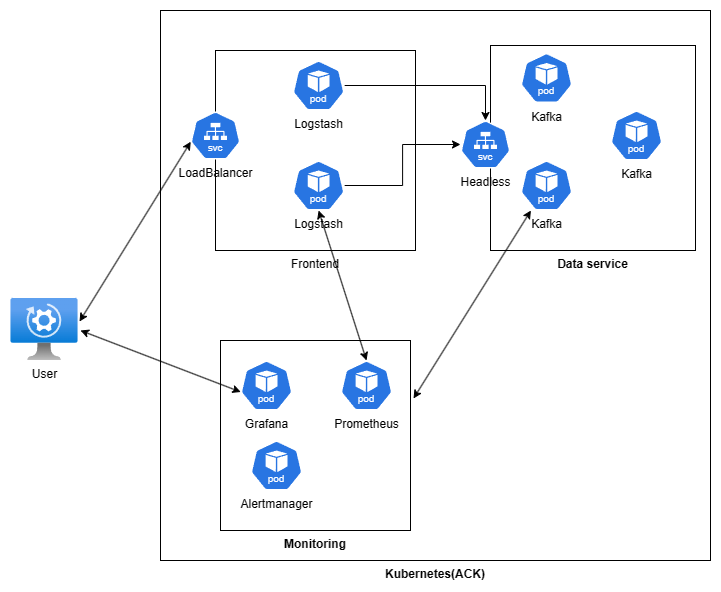
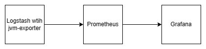
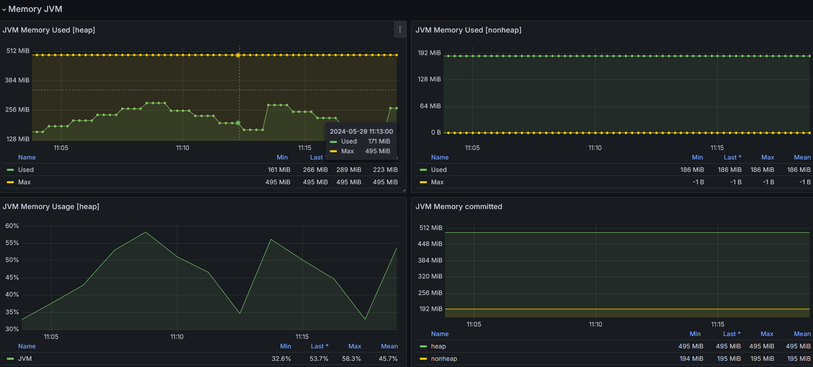
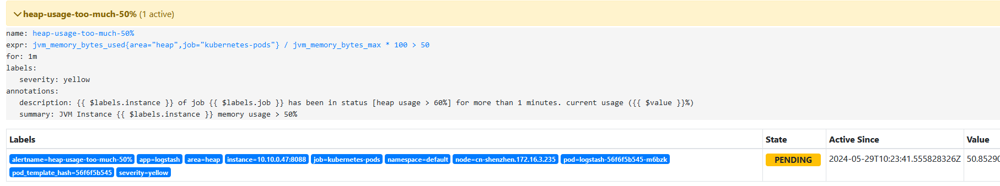
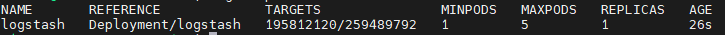
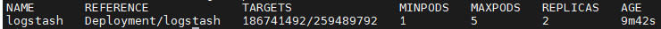
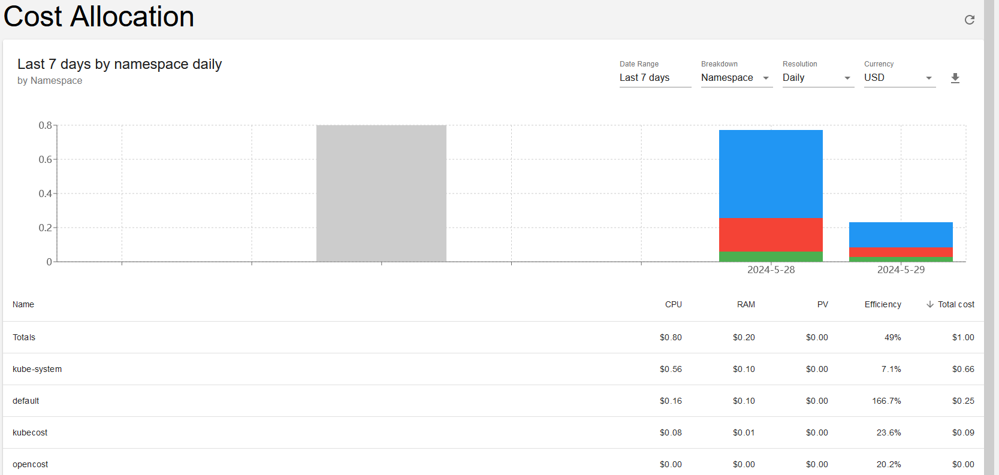

# 前言

对线上环境进行资源优化可以带来节省大量的基础设施成本，优化之前需要首先对资源使用情况进行监控。为了追求性能和稳定性，Java程序会通过把参数`-Xmx`和`-Xms`设置成一样的值来避免了频繁的回收和重新分配堆内存，这导致了在某些时候系统层面的内存监控无法得知Java程序的内存实际占用情况，容易造成了资源的浪费，本文介绍了一种低成本的对 Java程序内存实际使用情况进行监控的解决方案，同时就如何优化资源管控提供了一些看法。

# 基于JMX的JVM监控解决方案

JMX是[Java Management Extensions](https://www.oracle.com/technical-resources/articles/javase/jmx.html)的缩写，可以用来监控jvm的内存和服务，本方案采用[jmx-exporter](https://github.com/prometheus/jmx_exporter)和[prometheus](https://prometheus.io/docs/introduction/overview/)的来实现jvm metrics的暴露和收集。下图是PoC的架构简图，通过对 Logstash JVM内存监控来验证该方案的可行性。

- JMX Exporter 是一个用于将 JVM 的 JMX指标导出到 Prometheus 的工具，这里使用官方推荐的java agent的方式来启动。

  




主要有4部分组成：

- logstash作为java程序的前端模拟，它接受http请求，并把信息转存到kafka集群，同时开启jmx agent 暴露jmx 信息。

- prometheus + grafana + alertmanager 监控方案，prometheus负责从Logstash中采集jmx信息
- kafka集群，作为数据服务来提供服务。
- 在K8s集群外的User用来提供负载，通过压测工具[Grafana K6](https://grafana.com/docs/k6/latest/)来生成不同的并发请求

## JVM metrics采集




Java程序采用参数方式启动jmx-exporter，如：

```shell
java -javaagent:./jmx_prometheus_javaagent-0.20.0.jar=8088:config.yaml -jar yourJar.jar
```

对于K8s应用，需要重新构建一个包含jmx-exporter的docker image，如：

```shell
FROM ubuntu:22.04 as jar
WORKDIR /
RUN apt-get update -y
RUN DEBIAN_FRONTEND=noninteractive apt-get install -y wget
RUN wget https://repo.maven.apache.org/maven2/io/prometheus/jmx/jmx_prometheus_javaagent/0.20.0/jmx_prometheus_javaagent-0.20.0.jar

FROM docker.elastic.co/logstash/logstash:8.13.4
ADD prometheus-jmx-config.yaml /prometheus-jmx-config.yaml
COPY --from=jar /jmx_prometheus_javaagent-0.20.0.jar /jmx_prometheus_javaagent-0.20.0.jar
```

在POD启动的时候添加对应的环境变量，如对Logstash来说使用`$LS_JAVA_OPTS`。

```yaml
# 设置最大最小jvm内存都是512m
env:
- name: LS_JAVA_OPTS
  value: "-Xms512m -Xmx512m -javaagent:/jmx_prometheus_javaagent-0.20.0.jar=8088:/prometheus-jmx-config.yaml"
```

启动成功后，就可以通过`http://localhost:8088/metrics`来获取jmx信息了。

一些主要metrics介绍：

| Metrics                         | 说明                         |      |
| ------------------------------- | ---------------------------- | ---- |
| jvm_memory_bytes_used           | jvm内存实际使用量            |      |
| jvm_memory_bytes_max            | jvm内存的最大值              |      |
| jvm_gc_collection_seconds_count | 执行垃圾回收（GC）次数，     |      |
| jvm_gc_collection_seconds_sum   | 执行垃圾回收（GC）花费的时间 |      |

## Dashboard

使用grafana可以很清晰的看见java程序的实际内存占用量，如下图：



## JVM告警规则

根据这些metrics我们可以设置最基本的jvm监控规则：

```yaml
groups:
  - name: jvm-alerting
    rules:
    # 堆空间使用超过80%
    - alert: heap-usage-too-much-80%
      expr: jvm_memory_bytes_used{job="kubernetes-pods", area="heap"} / jvm_memory_bytes_max * 100 > 80
      for: 1m
      labels:
        severity: orange
      annotations:
        summary: "JVM Instance {{ $labels.instance }} memory usage > 80%"
        description: "{{ $labels.instance }} of job {{ $labels.job }} has been in status [heap usage > 80%] for more than 1 minutes. current usage ({{ $value }}%)"


    # 在5分钟里，Old GC花费时间超过50%
    - alert: old-gc-time-too-much-50%
      expr: increase(jvm_gc_collection_seconds_sum{gc="G1 Old Generation"}[5m]) > 5 * 60 * 0.5
      for: 5m
      labels:
        severity: yellow
      annotations:
        summary: "JVM Instance {{ $labels.instance }} Old GC time > 30% running time"
        description: "{{ $labels.instance }} of job {{ $labels.job }} has been in status [Old GC time > 30% running time] for more than 5 minutes. current seconds ({{ $value }}%)"
```

## 基于JVM监控指标的自动缩放

设置好jvm监控后，可以根据统计信息适当调整java程序的内存使用，对于一些无状态的java应用，也可以考虑使用K8s自动缩放来协助管理。

K8s 可以基于自定义metrics进行workload缩放（需要[metrics-server](https://github.com/kubernetes-sigs/metrics-server)，Prometheus和 [prometheus-adapter](https://github.com/kubernetes-sigs/prometheus-adapter))。

首先在prometheus-adapter里面添加自定义metrics配置。

```yaml
  - seriesQuery: '{__name__="jvm_memory_bytes_used",area="heap"}'
    resources:
      template: <<.Resource>>
    name:
      matches: ^(.*)$
      as: "jvm_memory_bytes_heap_used"
    metricsQuery: jvm_memory_bytes_used{area="heap",<<.LabelMatchers>>}
```

测试自定义指标：

```shell
kubectl get --raw /apis/custom.metrics.k8s.io/v1beta1/namespaces/default/pods/*/jvm_memory_bytes_heap_used | jq
```

创建基于`jvm_memory_bytes_heap_used`的[HPA](https://kubernetes.io/zh-cn/docs/tasks/run-application/horizontal-pod-autoscale/)

```yaml
apiVersion: autoscaling/v2
kind: HorizontalPodAutoscaler
metadata:
  name: logstash
spec:
  scaleTargetRef:
    apiVersion: apps/v1
    kind: Deployment
    name: logstash
  minReplicas: 1
  maxReplicas: 5
  metrics:
  - type: Pods
    pods:
      metric:
        name: jvm_memory_bytes_heap_used
      target:
        type: AverageValue
        # 超过heap最大值的50%就扩容
        averageValue: 259489792
```

## 测试

### Prometheus 告警

关闭 Logstash HPA，启动 Grafana k6生成流量给logstash适当的压力，可以观察到jvm 堆内存使用率快速上升，达到告警阈值（**50%**）可以在prometheus 页面观察到偶激活的告警产生。



### 水平扩容

开启 Logstash HPA



通用启动k6生成流量，可以观察到，当jvm 堆内存使用超过设定值的时候，deployment发生了扩容。如下图：




# 其它一些思考

## 基于日志的业务监控

通常我们可以认为如果一个java应用长时间jvm实际使用率都远低于分配的最大内存，这个应用就应该降低内存以节省资源，但是这还需要业务数据组合在一起才能形成更有效的证明，只有结合该应用的业务情况（访问速率，响应时间等）才能做出最准确的判断。

由于历史的原因，很多早期应用并没有实现业务监控功能，在这种情况下，我们可以尝试采用一些**非侵入式**的方式来获取业务情况的数据，例如通过处理日志信息，来实时获取业务当前的状态或分析历史数据来对业务运行情况进行全面的了解。下面这两款主流的日志系统都提供了基于日志的统计和告警。

### Grafana Loki

[Grafana Loki](https://grafana.com/docs/loki/latest/) 是一个轻量级的日志系统，它提供了根据日志生成[metrics]([Metric queries | Grafana Loki documentation](https://grafana.com/docs/loki/latest/query/metric_queries/)) 并发送到Prometheus的功能。Loki 采用类似于PromQL的查询语言，如：

```shell
# MySQL作业的每台主机最近几分钟内所有非超时错误的每秒速率，并且只包括持续时间超过10秒的错误。
sum by (host) (rate({job="mysql"} |= "error" != "timeout" | json | duration > 10s [1m]))
```

通过grafana可以很方便的根据这些metrics来生成统计图表，同时也可以利用Prometheus rules来进行监控和告警。

### Elasticsearch

存储在[Elasticsearch](https://www.elastic.co/)内的应用日志可以很方便的使用[Kibana](https://www.elastic.co/kibana/kibana-dashboard/)根据绘制应用的各种统计指标（前提是日志格式进行过良好的规范，否则性能会很差），这些信息和监控系统的数据相集合，我们可以得知该应用的实际运行情况，同时根据历史的运行情况，我们可以更好的规划该应用的未来资源分配。

同时可以通过Kibana的[Alert功能](https://www.elastic.co/guide/en/kibana/current/alerting-getting-started.html)，根据日志查询来判断是否触发告警。

## 更细化的成本管理

K8s上的Pod会经常变更难以追踪，业务分布情况复杂，而云厂商提供的成本统计粒度比较粗，没办法根据细粒度进行成本统计（如namespace），同时也有一定的滞后性。这里介绍一个开源产品[opencost](https://github.com/opencost/opencost) (Apache的license，可以放心使用），它可以通过各种资源的metrics来计算各资源所消耗的成本，同时各种不同的类型进行统计（如Node,Pod等），它同时有一个商业版的产品[kubecost](https://www.kubecost.com/)，提供了更强大的功能，可以提供一些成本管控和告警功能。



有了成本监控工具，可以很方便的针对某一业务或某一Owner进行成本统计，进一步通过管理的手段来推动业务部门优化资源分配。

