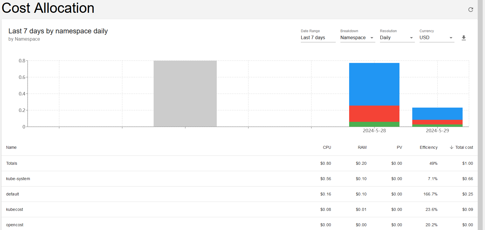

# 为什么需要专门的java内存监控

传统的基于主机或pod的内存监控，无法探查到JVM的内存实际使用情况，如下图：


**准确的资源使用情况是进行资源管理和性能调优的前提。**

# 基于JMX-Exporter 的jvm监控

## 为什么是jmx-exporter

对java程序的内存监控方案，需要做到：

1. 可以实时的获取到JVM的详细信息
2. 兼容现有的监控系统，可以很方便的集成
3. 尽量少的或者不修改Java程序代码

有许多java jvm分析调试工具，如`jstat`, `jinfo`, `jconsole`, `Visual VM`等，这些工具往往需要侵入到系统，并且无法和现有的监控系统集成。

## demo环境架构图


主要有4部分组成：

- logstash作为java程序的前端模拟，它接受http请求，并把信息转存到kafka集群，同时开启jmx agent 暴露jmx 信息。

- prometheus + grafana + alertmanager 监控方案，prometheus负责从Logstash中采集jmx信息
- kafka集群，作为数据服务来提供服务。
- [Grafana K6](https://grafana.com/docs/k6/latest/)用来生成流量，用来探测服务的limits

## 如何部署

Java程序采用参数方式启动jmx-exporter，如：

```shell
java -javaagent:./jmx_prometheus_javaagent-0.20.0.jar=8088:config.yaml -jar yourJar.jar
```

对于K8s应用，需要重新构建一个包含jmx-exporter的docker image，如：

```shell
FROM ubuntu:22.04 as jar
WORKDIR /
RUN apt-get update -y
RUN DEBIAN_FRONTEND=noninteractive apt-get install -y wget
RUN wget https://repo.maven.apache.org/maven2/io/prometheus/jmx/jmx_prometheus_javaagent/0.20.0/jmx_prometheus_javaagent-0.20.0.jar

FROM docker.elastic.co/logstash/logstash:8.13.4
ADD prometheus-jmx-config.yaml /prometheus-jmx-config.yaml
COPY --from=jar /jmx_prometheus_javaagent-0.20.0.jar /jmx_prometheus_javaagent-0.20.0.jar
```

在POD启动的时候添加对应的环境变量，如对Logstash来说使用`$LS_JAVA_OPTS`。

```yaml
# 设置最大最小jvm内存都是512m,并启动jmx agent
env:
- name: JAVA_OPTS
  value: "-Xms512m -Xmx512m -javaagent:/jmx_prometheus_javaagent-0.20.0.jar=8088:/prometheus-jmx-config.yaml"
```

启动成功后，就可以通过`http://localhost:8088/metrics`来获取jmx信息了。

## 主要监控指标

| Metrics                         | 说明                         |      |
| ------------------------------- | ---------------------------- | ---- |
| jvm_memory_bytes_used           | jvm内存实际使用量            |      |
| jvm_memory_bytes_max            | jvm内存的最大值              |      |
| jvm_gc_collection_seconds_count | 执行垃圾回收（GC）次数，     |      |
| jvm_gc_collection_seconds_sum   | 执行垃圾回收（GC）花费的时间 |      |

## 怎么配置告警

告警规则需要跟业务相结合，并没有统一的标准，要选择能够代表业务状况的指标。

这里提供一个使用负载测试工具Grafana K6来快速探测应用业务能力的方法，通过和jvm监控相结合一起来确定告警指标和阈值。

通过K6 的[断点测试](https://grafana.com/docs/k6/latest/testing-guides/test-types/breakpoint-testing/)来探测java应用单位Pod承受极限，


结合jvm监控的数据(gc)


把k6客户的统计信息和jvm相结合，我们可以选择合适的时间节点的值作为告警阈值


```yaml
groups:
  - name: jvm-alerting
    rules:
	# 1m 内young gc 超过8次
    - alert: jvm_gc_young_count_1m_over_8
      expr: increase(jvm_gc_collection_seconds_count{gc="G1 Young Generation"}[1m]) >= 8
      for: 1m
      labels:
        severity: orange
      annotations:
        summary: "JVM Instance {{ $labels.instance }} jvm_gc_young_count_1m >= 8 "
        description: "{{ $labels.instance }} of job {{ $labels.job }} has been in status jvm_gc_young_count_1m >=8 for more than 1 minutes. current usage ({{ $value }}%)"
```

## 基于自定义指标的Pod自动缩放

对于无状态的服务，我们可以的利用K8s的Pod自动缩放功能，来动态调整资源分配以节省资源。

首先在prometheus-adapter里面添加自定义metrics配置。

```yaml
  - seriesQuery: '{__name__="jvm_gc_collection_seconds_count",gc="G1 Young Generation"}'
    resources:
      template: <<.Resource>>
    name:
      matches: ^(.*)$
      as: "jvm_gc_young_count_1m"
    metricsQuery: increase(jvm_gc_collection_seconds_count{gc="G1 Young Generation", <<.LabelMatchers>>}[1m])
```

测试自定义指标：

```shell
kubectl get --raw /apis/custom.metrics.k8s.io/v1beta1/namespaces/logstash/pods/*/jvm_gc_young_count_1m | jq
```

创建基于`jvm_gc_young_count_1m`的[HPA](https://kubernetes.io/zh-cn/docs/tasks/run-application/horizontal-pod-autoscale/)

```yaml
apiVersion: autoscaling/v2
kind: HorizontalPodAutoscaler
metadata:
  name: logstash
  namespace: logstash
spec:
  scaleTargetRef:
    apiVersion: apps/v1
    kind: Deployment
    name: logstash
  minReplicas: 1
  maxReplicas: 5
  metrics:
  - type: Pods
    pods:
      metric:
        name: jvm_gc_young_count_1m
      target:
        type: AverageValue
        # 一分钟内gc超过8次扩容
        averageValue: 8
```

通过增加压力，成功让logstash的pod正确的经历了自动扩容和缩容


## 找出内存分配过多的java应用

为了防止有些应用申请了太多的内存，造成浪费，同时需要对空闲的内存使用情况进行监控

- 长时间jvm 内存使用率低，比如长时间低于70%
- gc次数很少并且gc时间很短

通常可以通过下面的办法来逐步推动资源优化：

1. 定期的资源使用review

2. 通过告警系统发出提醒通知

   可以根据前面测试得出的该应用单位pod能支持的业务量，和线上监控所显示的统计值进行比较，如果线上使用量远小于测量值，则可以考虑逐步降低内存分配。


Prometheus告警规则

```yaml
groups:
  - name: jvm-alerting
    rules:
    # 堆空间使用长时间低于50%
    - alert: heap-usage-too-little-50%
      expr: jvm_memory_bytes_used{job="kubernetes-pods", area="heap"} / jvm_memory_bytes_max * 100 < 50
      for: 30m
      labels:
        severity: yellow
      annotations:
        summary: "JVM Instance {{ $labels.instance }} memory usage < 50%"
        description: "{{ $labels.instance }} of job {{ $labels.job }} has been in status [heap usage < 50%] for more than 30 minutes. current usage ({{ $value }}%)"
```

## JVM调优

根据监控数据或压测信息，可以有针对性的对jvm参数进行调优来提高资源利用率。

# 更精细的成本管理

K8s上的Pod会经常变更难以追踪，业务分布情况复杂，而云厂商提供的成本统计粒度比较粗，没办法根据细粒度进行成本统计（如namespace），同时也有一定的滞后性。这里介绍一个开源产品[opencost](https://github.com/opencost/opencost) (Apache的license，可以放心使用），它可以通过各种资源的metrics来计算各资源所消耗的成本，同时各种不同的类型进行统计（如Node,Pod等），它同时有一个商业版的产品[kubecost](https://www.kubecost.com/)，提供了更强大的功能，可以提供一些成本管控和告警功能。



有了成本监控工具，可以很方便的针对某一业务或某一Owner进行成本统计，进一步通过管理的手段来推动业务部门优化资源分配。

